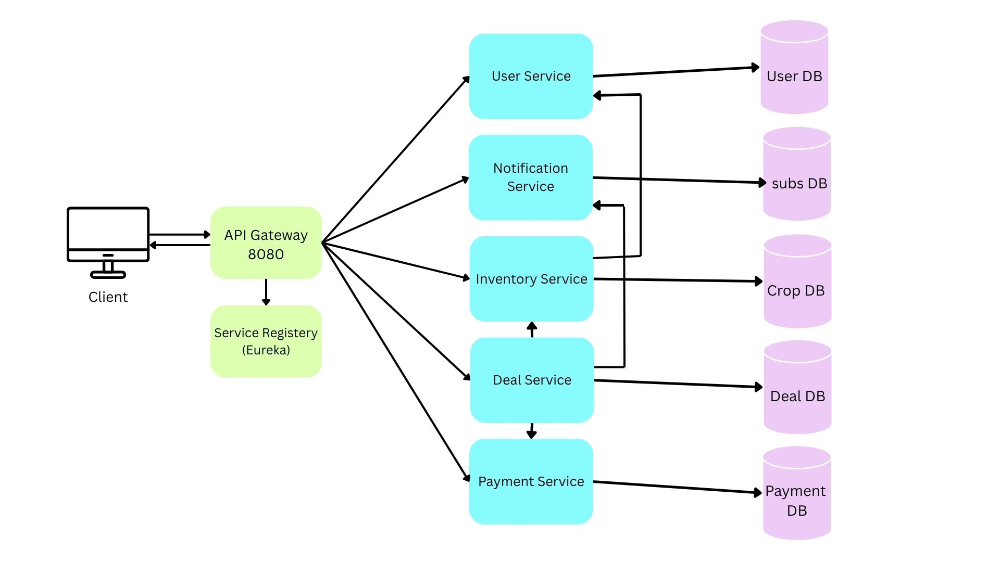

# CropDeal 🌾

A full-stack agricultural trade platform that digitizes crop trading between farmers and dealers. Farmers list their crops, dealers browse and negotiate deals, and payments are processed securely through Stripe — all built on a microservices architecture.

---

## Table of Contents

- [Architecture Overview](#architecture-overview)
- [Tech Stack](#tech-stack)
- [Microservices](#microservices)
- [Backend Components](#backend-components)
- [Database](#database)
- [Frontend](#frontend)
- [Getting Started](#getting-started)
- [Environment Variables](#environment-variables)
- [API Documentation](#api-documentation)
- [Testing](#testing)

---

## Architecture Overview



All services register with Eureka and communicate via OpenFeign. The API Gateway is the single entry point for all client requests.

---

## Tech Stack

### Backend
| Technology | Purpose |
|---|---|
| Spring Boot 3 | Microservice framework |
| Spring Cloud Gateway | API Gateway and routing |
| Spring Cloud Netflix Eureka | Service discovery |
| Spring Security + JWT | Authentication |
| Spring Data JPA | ORM and database access |
| OpenFeign | Inter-service communication |
| Stripe Java SDK | Payment processing |
| JavaMailSender | Email notifications |
| ConcurrentHashMap + AtomicInteger | In-memory rate limiting |
| SpringDoc OpenAPI | API documentation |
| SLF4J | Request/response logging |
| JUnit 5 + Mockito | Unit testing |
| MySQL | Database |

### Frontend
| Technology | Purpose |
|---|---|
| React | UI framework |
| Tailwind CSS | Styling |
| Chart.js | Analytics and data visualization |
| Axios | HTTP client |
| React Hot Toast | Notifications |
| Lucide React | Icons |

---
> 🖥️ **Frontend Repository** — [https://github.com/RaviPatel94/cropdealUI](https://github.com/RaviPatel94/cropdealUI)

## Microservices

| Service | Port | Database | Responsibility |
|---|---|---|---|
| eureka-server | 8761 | — | Service registry |
| api-gateway | 8080 | — | Routing, JWT validation, rate limiting |
| user-service | 8081 | cropdeal_users | Auth, farmer/dealer/admin management |
| inventory-service | 8082 | cropdeal_inventory | Crop listings CRUD |
| deal-service | 8083 | cropdeal_deals | Deal negotiation flow |
| notification-service | 8084 | cropdeal_subscriptions | Email alerts, subscriptions |
| payment-service | 8085 | cropdeal_payments | Stripe payments, invoices |

---

## Backend Components

### Eureka Server
Service registry where all microservices register on startup. Enables dynamic service discovery — services find each other by name without hardcoded URLs.

### API Gateway
Single entry point for all client requests. Handles routing to the correct microservice using Spring Cloud Gateway. Runs `AuthFilter` on all protected routes and the global `RateLimiterFilter` on all routes.

### JWT Authentication
Implemented at the gateway level. On every request the gateway validates the JWT token, extracts `userId`, `role`, and `email`, and forwards them as headers (`X-User-Id`, `X-User-Role`, `X-User-Email`) to downstream services. No individual service validates tokens.

```
Client → API Gateway (validates JWT) → Service (trusts X-User-* headers)
```

### Role-Based Access Control
Each service endpoint is protected using the `X-User-Role` header forwarded by the gateway. Three roles: `FARMER`, `DEALER`, `ADMIN`. Inter-service Feign calls use `INTERNAL` role via `FeignConfig` to bypass role checks.

### Rate Limiter
Custom in-memory rate limiter implemented as a `GlobalFilter` at the gateway. Uses `ConcurrentHashMap` with `AtomicInteger` for thread safety and a 60-second sliding window.

- Uses `X-User-Id` as key for authenticated requests
- Falls back to IP address for unauthenticated requests (login, register)
- Limits: Login → 5/min, Register → 3/min, All other → 20/min
- Automatic cleanup of expired entries every 60 seconds
- Returns `429 Too Many Requests` with `Retry-After: 60` header when exceeded

### Global Exception Handler
`@RestControllerAdvice` implemented in every service. Catches validation errors (`MethodArgumentNotValidException`), runtime exceptions, and generic exceptions — returning consistent structured JSON error responses.

```json
{
  "status": 400,
  "error": "Bad Request",
  "message": "Crop name is required"
}
```

### SLF4J Request/Response Logger
Servlet filter (`RequestResponseLoggingFilter`) added to all services. Logs every incoming request and outgoing response with method, URI, X-User-Role, response status, and duration. Uses `ContentCachingRequestWrapper` to allow body reading without consuming the stream. API Gateway uses a reactive `GlobalFilter` equivalent.

### Stripe Payment Gateway
Integrated in payment-service using Stripe Checkout Sessions. When a dealer initiates payment a hosted Stripe Checkout Session is created and the URL is returned to the frontend. After payment the session is verified directly via Stripe API and the deal is marked completed.

```
POST /api/payments → Stripe Session created → paymentUrl returned
→ User pays on Stripe hosted page
→ GET /api/payments/verify?sessionId=... → session verified → deal completed
```

### OpenFeign Inter-Service Communication
All inter-service calls use declarative Feign clients. A shared `FeignConfig` adds `X-User-Role: INTERNAL` and `X-User-Id: 0` headers to all Feign requests so internal endpoints don't reject them.

### Swagger UI
Configured via SpringDoc OpenAPI in all services. Accessible at `/swagger-ui/index.html` on each service port in dev. Includes JWT bearer token support for testing protected endpoints. Disabled in prod profile.

### JUnit 5 + Mockito
Unit tests written for all service layers. Dependencies are mocked as interfaces only (no concrete class mocking) to avoid ByteBuddy compatibility issues with Java 25. Tests cover success cases, validation failures, duplicate scenarios, and edge cases.

---

## Database

MySQL is used with one database per service keeping data fully isolated.

| Database | Tables |
|---|---|
| cropdeal_users | users |
| cropdeal_inventory | crop_listings |
| cropdeal_deals | deals |
| cropdeal_payments | payments, bank_accounts |
| cropdeal_subscriptions | subscriptions |

**No JPA relationships exist across services.** Cross-service data is handled by storing foreign IDs and fetching via Feign when needed, or by denormalizing data at write time (e.g. storing `cropName` in the deals table at deal creation).

---

## Frontend

Built with React, Tailwind CSS, and deployed separately.

### Authentication Pages

**`/login`** — Split-screen page with dynamic role switching between Farmer and Dealer. Farmer role includes signup. Dealer is login only. Stores JWT token in localStorage and sets cookie for middleware route protection.

**`/login/admin`** — Same split-screen design without role toggle. Validates `ADMIN` role on login response.

### Dashboards

Role is read from localStorage on dashboard load and the correct dashboard component is rendered.

**Farmer Dashboard**
| Tab | Features |
|---|---|
| Listings | View all listings, create new listing, edit, cancel |
| Deals | View incoming deals, accept or reject |
| Payments | View received payments history |
| Bank Account | Add or update bank account details |

**Dealer Dashboard**
| Tab | Features |
|---|---|
| Browse Listings | Search by crop name, filter by type, create deal |
| My Deals | View all deals, cancel pending, initiate Stripe payment |
| Payments | View payment history, verify pending payments |
| Subscriptions | Subscribe to crop types, manage subscriptions |

**Admin Dashboard**
| Tab | Features |
|---|---|
| Farmers | View all farmers, edit profile, toggle active status |
| Dealers | View all dealers, edit profile, toggle active status |

### Payment Flow (Frontend)
```
Dealer clicks Pay
→ POST /api/payments returns { paymentUrl, transactionReference }
→ window.location.href = paymentUrl (redirect to Stripe)
→ User pays on Stripe hosted page
→ Stripe redirects back to /dashboard?session_id=cs_test_...
→ useEffect reads session_id from URL params
→ GET /api/payments/verify?sessionId=... called automatically
→ Toast shown with payment result, deals and payments refreshed
```

---

## Getting Started

### Prerequisites
- Java 21+
- Maven
- MySQL
- Node.js 18+

### 1. Clone the repository
```bash
git clone https://github.com/yourusername/cropdeal.git
cd cropdeal
```

### 2. Set up databases
MySQL databases are created automatically via `createDatabaseIfNotExist=true` in dev profile. Just make sure MySQL is running.

### 3. Configure properties
Each service has `application.properties` (shared), `application-dev.properties` (local), and `application-prod.properties` (production with env vars). Update passwords in dev properties as needed.

### 4. Start services in order
```bash
# 1. Eureka Server
cd eureka-server && mvn spring-boot:run

# 2. API Gateway
cd api-gateway && mvn spring-boot:run

# 3. All other services (order doesn't matter after eureka is up)
cd user-service && mvn spring-boot:run
cd inventory-service && mvn spring-boot:run
cd deal-service && mvn spring-boot:run
cd notification-service && mvn spring-boot:run
cd payment-service && mvn spring-boot:run
```

### 5. Start Frontend
```bash
cd cropdeal-ui
npm install
npm run dev
# runs at http://localhost:5173
```

---

## Environment Variables

Production deployments use environment variables. Each service has an `application-prod.properties` referencing these.

### Common (all services except eureka and gateway)
```env
DB_URL=jdbc:mysql://your-host:3306/cropdeal_<service>
DB_USERNAME=your_db_user
DB_PASSWORD=your_db_password
EUREKA_URL=http://your-eureka-host:8761/eureka/
```

### user-service additional
```env
JWT_SECRET=your_jwt_secret_key
```

### api-gateway additional
```env
JWT_SECRET=your_jwt_secret_key
EUREKA_URL=http://your-eureka-host:8761/eureka/
```

### notification-service additional
```env
MAIL_USERNAME=your_gmail@gmail.com
MAIL_PASSWORD=your_gmail_app_password
```

### payment-service additional
```env
STRIPE_SECRET_KEY=sk_live_your_stripe_key
FRONTEND_URL=https://your-frontend-url.com
```

---

## API Documentation

Swagger UI is available in dev mode at:

| Service | URL |
|---|---|
| user-service | http://localhost:8081/swagger-ui/index.html |
| inventory-service | http://localhost:8082/swagger-ui/index.html |
| deal-service | http://localhost:8083/swagger-ui/index.html |
| notification-service | http://localhost:8084/swagger-ui/index.html |
| payment-service | http://localhost:8085/swagger-ui/index.html |

To test protected endpoints in Swagger UI — click Authorize and enter `Bearer <your_jwt_token>`.

### Key Endpoints

**Auth**
```
POST /api/auth/register
POST /api/auth/login
```

**Inventory**
```
GET    /api/inventory/listings          - all available listings
GET    /api/inventory/listings/my       - farmer's own listings
POST   /api/inventory/listings          - create listing (FARMER)
PUT    /api/inventory/listings/{id}     - update listing (FARMER)
DELETE /api/inventory/listings/{id}     - cancel listing (FARMER)
GET    /api/inventory/listings/search   - search by crop name
GET    /api/inventory/listings/type/{type} - filter by VEGETABLE or FRUIT
```

**Deals**
```
POST   /api/deals                  - create deal (DEALER)
GET    /api/deals/my/farmer        - farmer's incoming deals
GET    /api/deals/my/dealer        - dealer's outgoing deals
PUT    /api/deals/{id}/accept      - accept deal (FARMER)
PUT    /api/deals/{id}/reject      - reject deal (FARMER)
PUT    /api/deals/{id}/cancel      - cancel deal (DEALER)
```

**Payments**
```
POST   /api/payments                          - initiate Stripe payment (DEALER)
GET    /api/payments/verify?sessionId=...     - verify after Stripe redirect
GET    /api/payments/my/dealer                - dealer payment history
GET    /api/payments/my/farmer                - farmer payment history
GET    /api/payments/deal/{id}                - payment for a specific deal
GET    /api/payments/{id}/invoice             - generate invoice
GET    /api/payments/{id}/receipt             - generate receipt (SUCCESS only)
```

**Notifications**
```
POST   /api/notifications/subscribe           - subscribe to crop (DEALER)
GET    /api/notifications/subscriptions       - my subscriptions
DELETE /api/notifications/subscribe/{id}      - unsubscribe
```

**Admin**
```
GET    /api/admin/farmers                     - all farmers
GET    /api/admin/dealers                     - all dealers
PUT    /api/admin/users/{id}/toggle-status    - activate or deactivate user
PUT    /api/admin/users/{id}                  - update user details
```

---

## Testing

Unit tests are written for all service layers using JUnit 5 and Mockito.

```bash
# Run tests for a specific service
cd user-service && mvn test
cd payment-service && mvn test

# Run all tests
mvn test --projects user-service,inventory-service,deal-service,payment-service,notification-service
```

### Testing Stripe Payments Locally

Use Stripe test cards on the hosted checkout page:

| Card Number | Scenario |
|---|---|
| `4242 4242 4242 4242` | Payment succeeds |
| `4000 0000 0000 0002` | Payment declined |
| `4000 0025 0000 3155` | Requires 3D Secure |

Use any future expiry date and any 3-digit CVV.

For quick backend testing without opening Stripe:
```
PUT /api/payments/dev/force-success/{paymentId}
```
This endpoint bypasses Stripe and directly marks a payment as SUCCESS. **Remove before production.**

---

## Profiles

Each service supports two Spring profiles:

| Profile | Config File | Use Case |
|---|---|---|
| `dev` | `application-dev.properties` | Local development, hardcoded values, Swagger enabled, all actuator endpoints exposed |
| `prod` | `application-prod.properties` | Production, env var based config, Swagger disabled, only health actuator exposed |

Switch profile in `application.properties`:
```properties
spring.profiles.active=dev
```

Or pass at runtime:
```bash
java -jar service.jar --spring.profiles.active=prod
```

---

## User Roles

| Role | Can Do |
|---|---|
| FARMER | Create/edit/cancel listings, accept/reject deals, view payments, manage bank account |
| DEALER | Browse listings, create deals, cancel pending deals, initiate payments, manage subscriptions |
| ADMIN | View all users, edit profiles, toggle user active status |

---

## Project Structure

```
cropdeal/
├── eureka-server/
├── api-gateway/
│   └── filter/
│       ├── AuthFilter.java
│       ├── GatewayLoggingFilter.java
│       └── RateLimiterFilter.java
├── user-service/
├── inventory-service/
├── deal-service/
├── notification-service/
├── payment-service/
│   └── service/
│       ├── StripeService.java
│       ├── StripeServiceI.java
│       └── StripePaymentResult.java
└── cropdeal-ui/          ← React frontend
    ├── src/
    │   ├── components/
    │   │   └── dashboards/
    │   │       ├── FarmerDashboard.jsx
    │   │       ├── DealerDashboard.jsx
    │   │       └── AdminDashboard.jsx
    │   ├── lib/
    │   │   ├── api.js
    │   │   └── auth.js
    │   └── pages/
    │       ├── login/
    │       └── dashboard/
    └── .env
```
